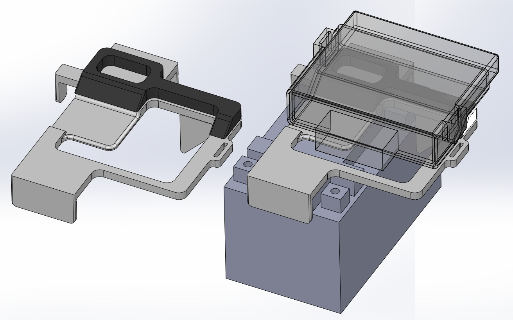
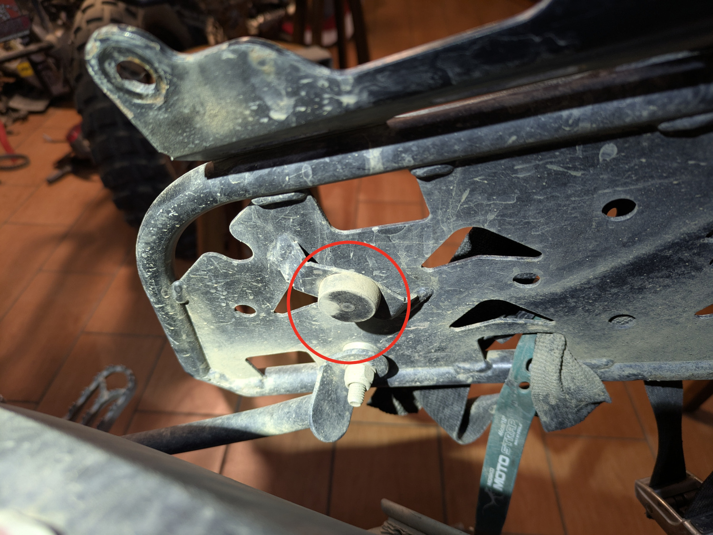
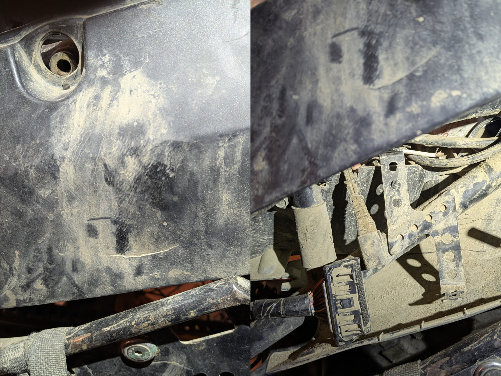

# ECU Relocation

This is a support for the ECU to be relocated from the side of the frame to just over the battery. It consists of:

- [Base](cad/v02/battery_topper-v02.stl) - the main support for the ECU that mounts to the battery via the battery's strap
- [Wedge](cad/v02/wedge-v02.stl) - because the ECU is "upside down" with the flat side up, this provides support to the non-flat side facing the battery

The primary goal was to find a position for the ECU that put the least strain on the wires. This means that the ECU is justified to the right side of the bike to allow the greatest amount of space for the wires. 

## Installation Notes

- I rerouted the ECU wire assembly next to and over the airbox to enter the battery compartment along with the other cables on the top left side. I did not cut or trim anything the box, but be sure the wire bundle is not rubbing against anything.
- At the very least, the strap on the OEM seat will have to be removed in order to make space for the ECU. I had to cut some of the plastic off of the bottom of my seat.
- The mount has slots that align with the slots of the OEM rubber cover for the ECU. You will have to print our source 2x shims approximately 3x16x37mm to mount the ECU to the [Base](cad/v02/battery_topper-v02.stl)
- You can probably get away without using any tape for the [Base](cad/v02/battery_topper-v02.stl), but the [Wedge](cad/v02/wedge-v02.stl) will need some.

## Why?

Though uncommon, some people have cracked their ECU after the perfect fall. I personally noticed that one of the mounting tabs for the ECU that is welded to the frame was bent, so I figured I had pushed my luck far enough.

The [Rally Raid Soft Luggage Rack](https://www.rallyraidproducts.co.uk/products/t7-soft-luggage-racks) might have been a contributor to this. There is a solid rubber mount on the inside of the rack, presumably intended to buffer the rack from the bike.

This is inexplicably placed *directly* over the ECU, and in my case, it cracked the plastics.

## Changes

- v02
  - Removed the left-rear support because it interfered with the starter relay.
  - Increased the open space where the strap runs to allow for easier attachment.
  - Added left/right tabs to better index on the battery.
  - Extended forward the front-facing tab to accommodate more batteries.
  - Increased the width of the space where the strap attaches.
  - Reduced the height of the wedge to account for height added by double-sided tape.

## Support

If you find this useful, consider helping keeping the ~~beer fridge~~ [Nalgene flasks](https://nalgene.com/product/10oz-flask/) stocked...

