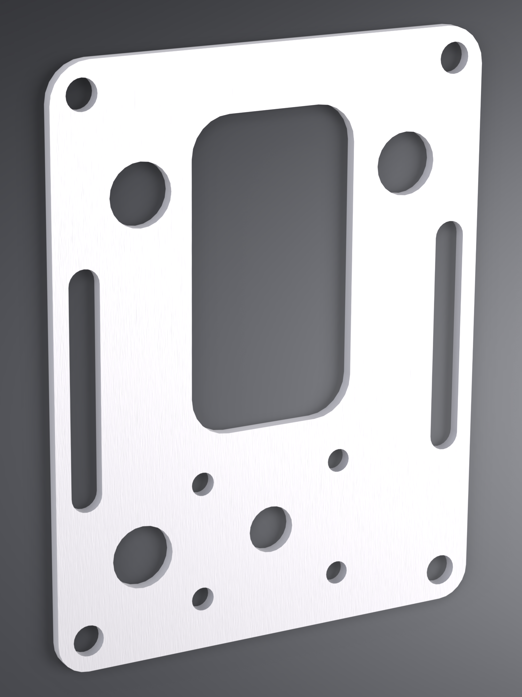
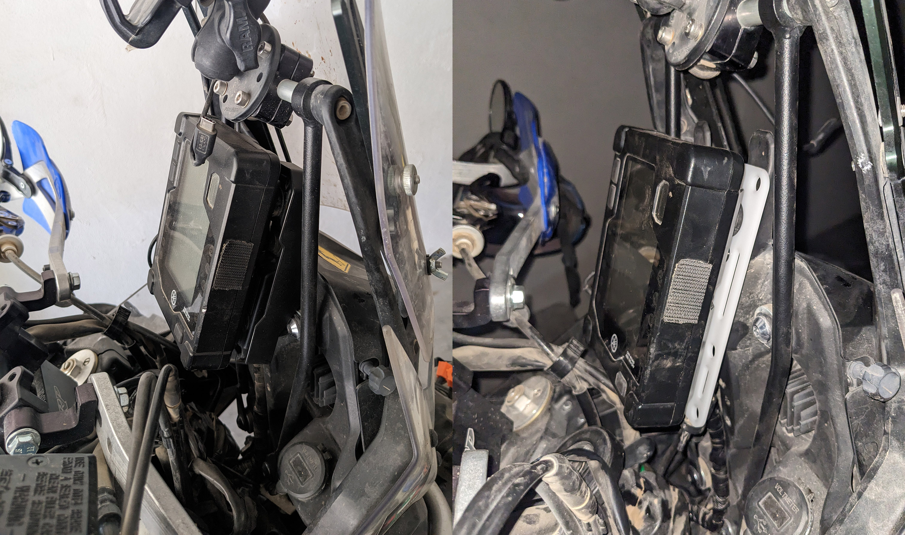

# Meter Bracket - OEM

This bracket can replace Yamaha part [BW3-F834L-00-00](https://yamaha-motor.com/parts/diagram/10635215/242368756?partNumber=BW3F834L0000) or can be used to help relocate the [Display Meter](https://yamaha-motor.com/parts/diagram/10635215/242368756?partNumber=BW3F834L0000) elsewhere, such as the handlebars.

## Overview

In addition to the hole pattern for the [Display Meter](https://yamaha-motor.com/parts/diagram/10635215/242368756?partNumber=BW3F834L0000), this has:

- 8mm holes in all corners and 8mm slots, which together can accommodate the handlebar clamps
- An [AMPS hole pattern](https://support.garmin.com/en-US/?faq=gwpdFQdJfH4oFEZ6hC4gG6)

Replacing the OEM Bracket could be helpful if:

- You have a larger tablet and the Display Meter interferes with the mount or cables.
- You have handguards that come close to, or barely touch the Display Meter with the handlebars at full lock. Experiencing a crash with this setup can forcefully lock the bars and cause additional flex that places enough force on the Display Meter to [crack the LCD display](https://www.tenere700.net/topic/6937-smashed-lcd-dash-need-replacement/).

Additional hardware would be required to relocate to the handlebars.

## Fabrication Notes

**Recommended material:** 5052 aluminum or a composite
**Recommended gauge:** 3mm
**Reference dimensions:** front face width: 112mm / front face height: 150mm

This is a flat version of the bracket used to hold the Tenere's display. This can be used in its existing location to push the display forward.

This should be made from a material 3mm thick to accommodate the OEM grommets.

## Installation Notes

If installing this in lieu of the [OEM bracket](https://yamaha-motor.com/parts/diagram/10635215/242368756?partNumber=BW3F834L0000), remove the OEM bracket, remove the (3) [OEM Dampers](https://yamaha-motor.com/parts/diagram/10635215/242368756?partNumber=5PS835130000) and place them on the Meter Bracket. Use the [OEM Screws](https://yamaha-motor.com/parts/diagram/10635215/242368756?partNumber=901640500100) to mount the Display Meter and reinstall.

## Other Notes

There is a 5mm gap between the front face of this bracket and the back face of the Display Meter, however the (4) corner holes have ~10mm of clearance. This is important to keep in mind when selecting hardware if you intend to mount the Display Meter somewhere other than the OEM location.

The connector and wiring harness sticks out approximately 25mm from the rear face of this bracket.

## Necessary hardware

None if mounting in the OEM location.

## Support

If you find this useful, consider helping keeping the beer fridge stocked...

