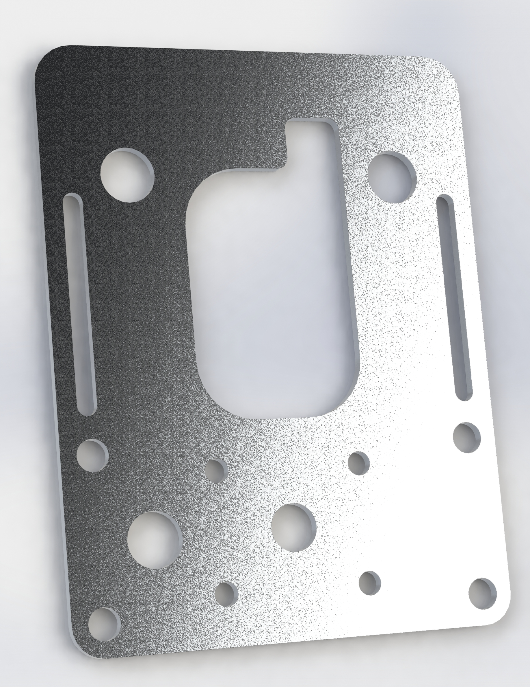

# bracket-meter

This bracket replaces Yamaha part BW3-F834L-00-00.

This is a flat version of the bracket used to hold the Tenere's display. This can be used in its existing location to push the display forward.

It also has holes in an AMPS pattern and holes that match the bar clamps. In both of these cases, spacers would be required to lift the bracket up a bit to allow the cable to pass underneath.
