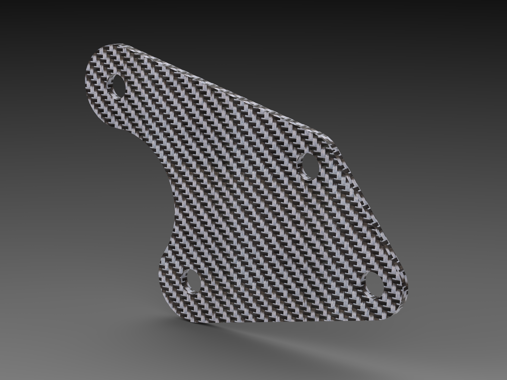
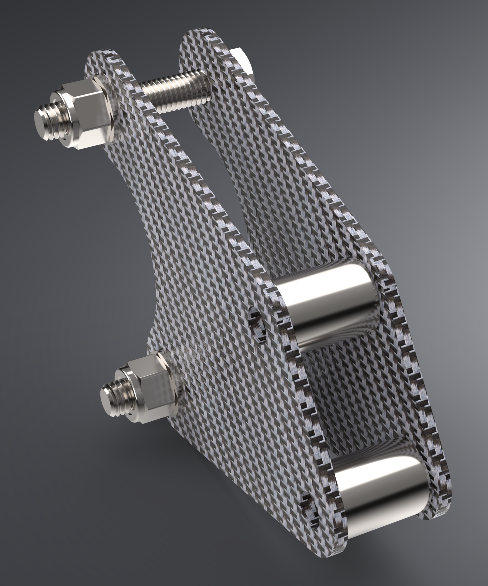
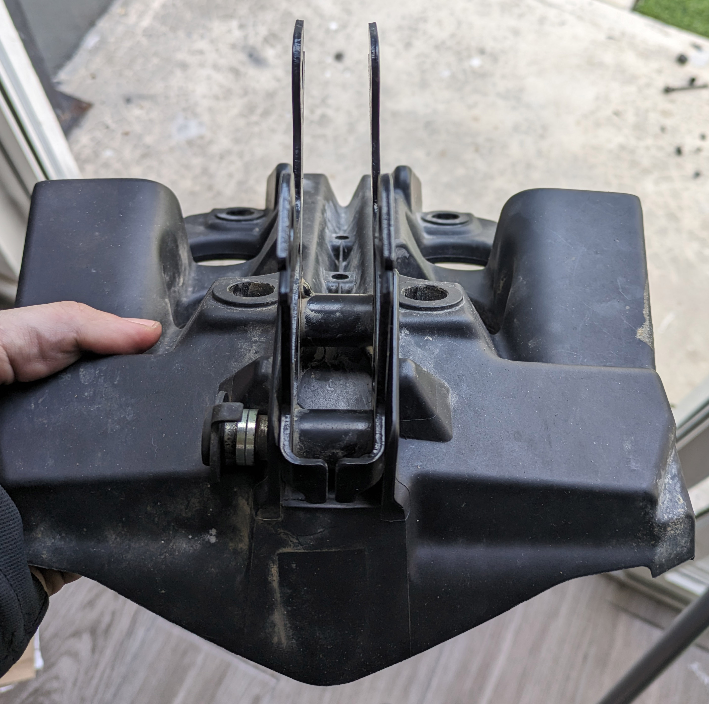

# Support Bracket - OEM

Two of these brackets and two spacers replace Yamaha part [BW3-2831V-10-00](https://yamaha-motor.com/parts/diagram/10635215/242410301?partNumber=BW32831V1000).

## Overview

The [OEM bracket](https://yamaha-motor.com/parts/diagram/10635215/242410301?partNumber=BW32831V1000) is essentially two pieces of steel sheet with spacers welded in between. This part attaches to the headlight stay.

Especially when using crash bars that use this as an attachment point, this bracket can bend. Due to how the front is configured, this can skew the headlight and cause the side panels to be misaligned. This is an extremely mild case:

The OEM bracket can generally be bent back out, but this serves as a permanent fix at approximately the same price point as the OEM bracket.

## Fabrication Notes

**Recommended material:** Carbon fiber or G10 fiberglass; 7075 T6 aluminum
**Recommended gauge:** 3mm, 2mm
**Reference dimensions:** 64mm between center of frame bolts

A composite is highly recommended primarily because this assembly occasionally sees lateral impacts from hard crashes where the side panels are impacted. With the bike at stock this is rare, but using crash bars that bolt onto this assembly greatly increases the likelihood of lateral stress. A metal will bend, such as with the OEM bracket, but a composite may flex and then return to its original position.

A thinner, 2mm composite may be better since it would allow for more flex if you do experience lateral force here while still springing back, which would take stress off of the headlight assembly.

The price to fabricate (2) of these using [SendCutSend](https://sendcutsend.com) is approximately $50 for 3mm carbon fiber and $21 for 3.2mm G10 fiberglass.

## Other Notes

The outer width of the [OEM bracket](https://yamaha-motor.com/parts/diagram/10635215/242410301?partNumber=BW32831V1000) (from outer face to outer face) is 27mm. This design references a material gauge of 3mm for each bracket, leaving 21mm of inner space that needs to be filled. This design calls for 20mm spacers, each paired with (2) M8 washers to fill this void, however depending on the specific hardware used, the two washers may not be necessary.

Try to bring the gap as close to 21mm as possible, but there is a 1-2mm tolerance either way and does not need to be exact. However, ensure that you are consistent with what you do across all the spacers.

---

The [OEM bolts](https://yamaha-motor.com/parts/diagram/10635215/242410301?partNumber=BW3283360000) and [OEM nuts](https://yamaha-motor.com/parts/diagram/10635215/242410301?partNumber=901760800900) that attach the assembly to the frame can be reused, however they are fairly short. Since these support virtually all the weight of the whole tower assembly, it is recommended that you source quality bolts long enough to have enough thread outside the nut, which should be a locking nut of sorts.

---

Although steel spacers are referenced below, aluminum spacers are preferred.

## Necessary hardware

|Component|Part Number|Quantity|
|--|--|--|
|bracket-support-oem|-|2|
|M8 20mm spacer|[92871A847](https://www.mcmaster.com/catalog/129/3668/92871A847)|2|
|M8x45 hex head bolt|[91287A307](https://www.mcmaster.com/91287A307/)|2[^1]|
|M8 locknut|[93625A114](https://www.mcmaster.com/93625A114)|2[^1]|
|M8 washer|[93475A270](https://www.mcmaster.com/93475A270/)|4[^1] and 2-4[^2]|

[^1]: if not reusing [OEM bolts](https://yamaha-motor.com/parts/diagram/10635215/242410301?partNumber=BW3283360000)*
[^2]: as needed to fill the any gap in between spacers and the bracket

## Support

If you find this useful, consider helping keeping the ~~beer fridge~~ [Nalgene flasks](https://nalgene.com/product/10oz-flask/) stocked...

