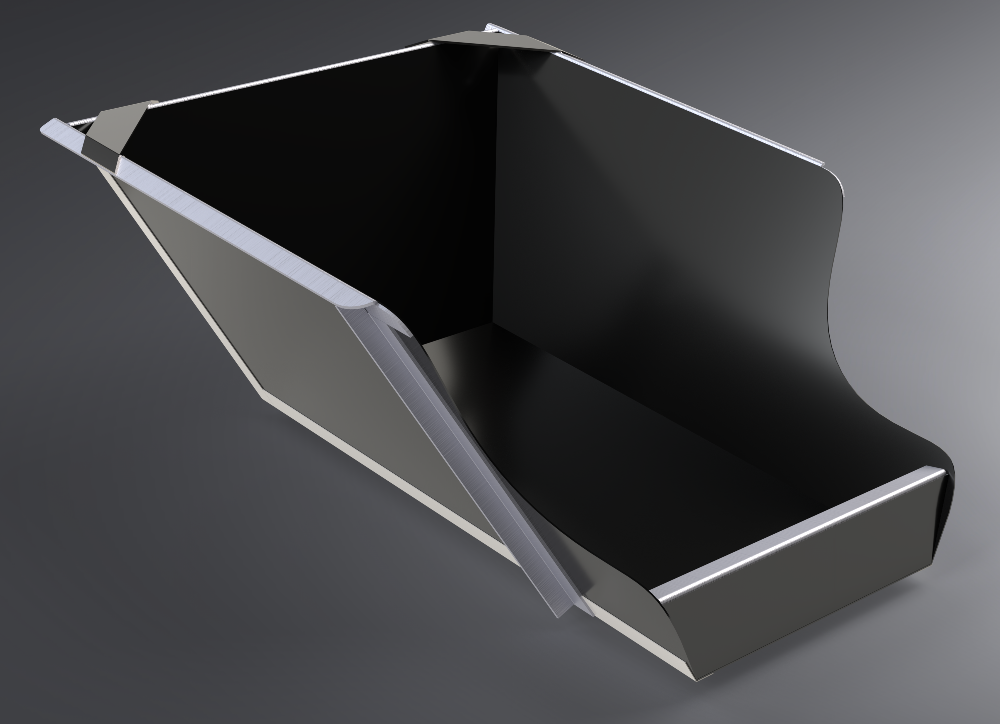

# Carrier, Dog

This is the design for the carrier I built for Surak, the dog. It is generally comprised of three different types of parts:

- [Panels](panels) - The sides and bottom are all made of composite, either fiberglass or carbon fiber.
- [Joints](joints) - Joints are lightweight sheet metal whose purpose is just to attach the panels together and hold them in place.
- [Braces](braces) - These are (mostly) 90 degree angle pieces that give the entire structure its rigidity. The only parts not made out of angle are the two tabs on the top rear.

Together these form a lightweight and extremely strong carrier.

This is a design for a *carrier only*. Since every motorcycle is different, a mount will have to be created for your application. This design offers a great deal of flexibility regarding mounts: there is plenty of real estate to drill holes and bolt stuff onto, and the design is strong enough to support mounts in pretty much any reasonable place.

## Organization

Currently in the [CAD/STEP]( directory you will find:
	`dog_carrier-v01.STEP`: The basic configuration of the panels, joints, and braces without any holes for fastening.
	`dog_carrier-bolt_holes-v01.STEP`: This is the same as above but has 4mm holes to bolt everything together.
	
Each directory ([panels](panels), [joints](joints), and [braces](braces)) currently has flat vector files for each part. You can submit these to [SendCutSend](https://sendcutsend.com/) for fabrication. Specifications can be found in the respective directories.

## How do I build it?

This version is an initial model that provides general sizes and angles. A future version will include more detailed plans and diagrams, including optional bolt holes, side patterns for mounting things, and files that you can submit to [SendCutSend](https://sendcutsend.com/) to have the parts produced there.

- [Panels](panels) - Composites are harder to work with if you're not setup for it. I recommend these be fabricated by SendCutSend or another local service.
- [Joints](joints) - These are all 22 gauge stainless steel sheet metal cut to size, bent, and drilled. Cutting and drilling are simple, but bending uniformly and to the appropriate angles might be difficult without the appropriate tools.
- [Braces](braces) - These are by far the easiest to make yourself. While the plans here call for sheet metal to be bent to 90 degrees, you can simply use angle aluminum which is both cheaper and stronger. With this method, all you have to do is cut these pieces to length, file off some edges, and drill holes. You can save a significant amount of money doing this.

## Other notes

This is a work in progress. I'm doing it from the road and in my free time, so I can't guarantee everything about it, but please reach out to me if you have any questions or concerns. I'm making every effort to improve the design and make it easy to use/build.

## Discussion, feedback, and questions

If you have any feedback, suggestions, or questions, feel free to contact me here, on social media, or at scott@advgoats.com.

If you do wind up using this design, share some pictures!

## Support

If you find this useful, consider helping keeping the ~~beer fridge~~ treat bags stocked...

See what living on a couple motorcycles with a dog is like:

 