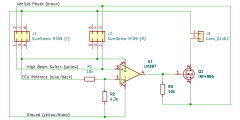

# Tenere 700 High Beam Invert

## Background

Traditionally the high beam switch on motorcycles is a simple on/off switch for another light. The Tenere is different: a wire coming from the ECU splits into two wires: one going directly to the headlight (blue/black) and one going to the high beam switch before also going to the headlight (solid yellow).

This wire from the ECU puts out a low voltage when turn the key on but before starting the engine (I don't remember exactly what it is) and 12V when the engine is running. This is just a **logic** signal and is not meant to provide power to any devices.

With just the low beams on, the switch is closed (on). When you turn the high beams on, you open the switch (off).

The headlight then chooses what to do based on the voltages it sees on the two wires coming into it. If the voltage is low on the blue wire, only the running light is powered. If there's 12V on the blue wire, the low beams are on, and if there is 12V on the blue wire but 0V on the yellow wire (coming from the high beam switch), then the high beams are on.

Since the high beam switch is essentially backwards (switch off = high beams on), this logic needs to be inverted in order to use the high beam switch to turn auxiliary lights on.

## Relay

This **can** be accomplished with a relay, but there have been reports of damaged ECUs. Inductive kickback from the relay can put stress on electrical components and eventually lead to their failure.

## Comparator circuit

The safest way to use the OEM high beam switch to turn on lights is with a circuit that compares the voltage on the two wires, like the OEM headlight. This circuit uses an LM397 comparator IC to compare voltages.

The comparator is inactive when the voltage from the high beam wire (yellow) is > ~4V. In other words, when the high beam switch is off. The comparator's output is pulled up to 12V when it's inactive.
The comparator activates when the voltage from the high beam wire (yellow) is < ~4V. In otherwords, when you turn the high beam switch on, the comparator activates, which latches its output to ground.

The comparator's output drives a P-channel MOSFET, so when the comparator is inactive and outputting 12V, the MOSFET is off. When the comparator activates (high beam switch = on), the comparator's output drops to ground and the MOSFET turns on, powering whatever you have plugged into it.

This schematic shows this as a pass-through circuit, meaning you can plug this inline with the OEM headlight to power auxiliary lights. Depending on the current draw of whatever you are powering, you might want to use a different power line for pin 3 of the MOSFET since the power line for the OEM headlight is a smaller gauge wire.