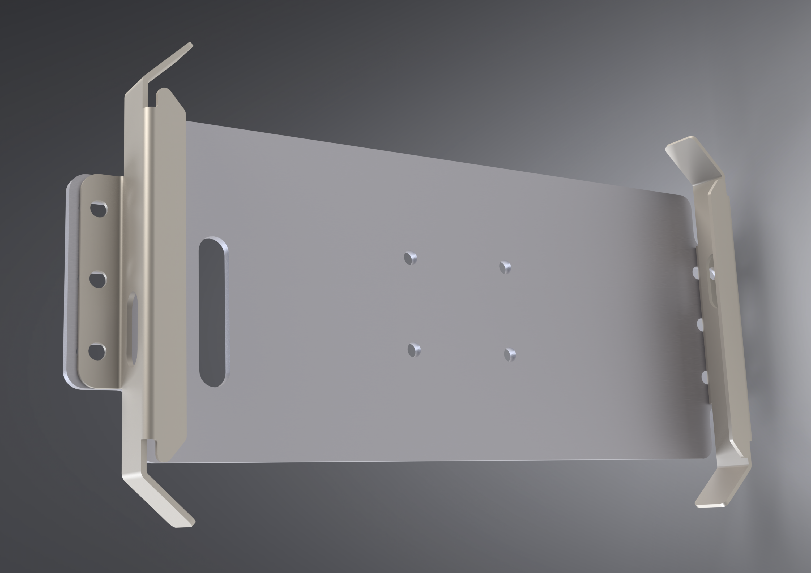

# Tablet Mount

This is a mount for a tablet or other large device. It's sized for a Tripltek 9 but could possibly hold devices of similar dimensions.

## Overview

This assembly is comprised of a flat back and two clamps at either end. The back has a cutout at the approximate location for the Tripltek 9's magnetic charging cable and the clamp has a cutout for a USB cable positioned where the Tripltek's USB port is.

There is approximately 205-225mm of space between the inner face of the clamps, so without modification this mount will accommodate a device of roughly that size.

## Fabrication Notes

### Back plate

**Recommended material:** 6061 aluminum

**Recommended gauge:** 3mm

**Reference dimensions:** total width: 225mm / total height: 100mm

The four holes of the AMPS pattern in the center should be countersunk.

The slot for the magnetic charging cable can be removed if not needed. The slots on either side for the clamps can be extended inward to accommodate devices that are smaller.

### Clamps

**Recommended material:** 304

**Recommended gauge:** 3mm

**Reference dimensions:** total width: 225mm / total height: 100mm

**Bend angles:**

- `Top tab`: 92 degrees down
- `Side tabs`: 47 degrees down
- `Bottom tab (with holes)`: 90 degrees up

## Other Notes

If using [SendCutSend](https://sendcutsend.com) to fabricate this, there will be some deformation of the clamps because the cutout for the USB cable is too close to the bend lines. I didn't have a problem with this and it functions just fine with the deformation, but if you want to avoid this, you can remove the cutout and cut it out yourself.

## Necessary hardware

|Component|Part Number|Quantity|
|--|--|--|
|clamp|-|2|
|back-plate|-|1|
|M5 countersunk bolts|-|4[^1]|
|M5 nuts|[91287A307](https://www.mcmaster.com/91287A307/)|2[^2]|
|M5x12 bolts|[90991A127](https://www.mcmaster.com/90991A127/)|8[^3]|

[^1]: Length will depend on your use case.
[^2]: You can use wingnuts to make it easier to remove the tablet.
[^3]: Alternatively you can use [tamper resistant bolts](https://www.mcmaster.com/91900A856/) to make it harder to remove the tablet.

## Support

If you find this useful, consider helping keeping the beer fridge stocked...

