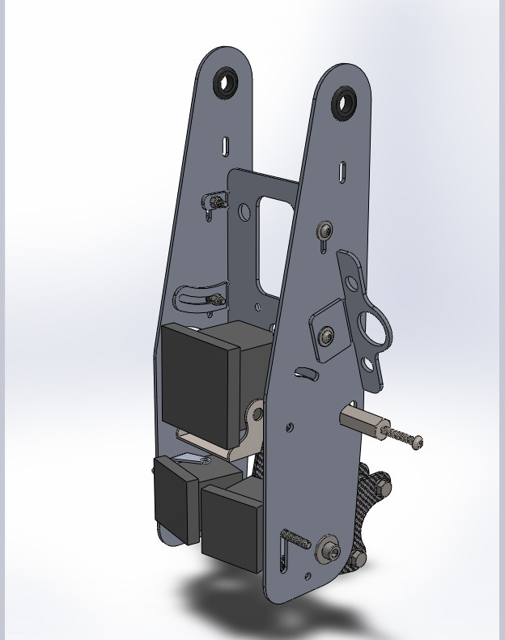
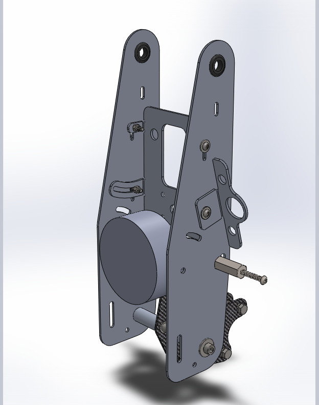
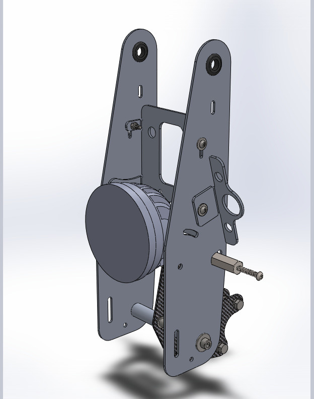

# Aftermarket Lights

## Considerations

Aside from price, size, and quality/reliability, these are probably the most significant things to consider when selecting a light.

### Total luminosity

This is the easiest spec to compare from an advertising perspective since bigger always equals better, right? There are various ways to measure total luminosity. Frankly I don't fully understand all the nuances involved, but really it doesn't matter as long as you take the numbers as generalities.

### Beam pattern

This is probably the most important component of lights and something that you will rarely see illustrated. Baja Designs has a [good article](https://www.bajadesigns.com/help/lighting-zones/) about beam patterns, but their specific categorization is only applicable to *their* lights. This makes selecting their products simple, but doesn't help with other manufacturers who are generally more opaque about the actual beam pattern. A light with 1 billion lumens sounds cool, but if it's all concentrated on one spot 100m in front of you, it's not helpful for driving.

Many "auxiliary lights" fall into two categories: spot beams for distance (which are generally used only with your high beams), or fog lights, which only illuminate the area immediately in front of you. Unfortunately this means they are not suitable as a *driving light* by themselves since they have a pretty narrow pattern, whether that pattern is narrow vertically or horizontally. This makes sense since they're auxiliary lights, not primary lights.

Some lights (LP4, XL80, R7, D7 Pro) are designed and advertised as driving lights and fit that role well. They are a good option for a plug-and-play solution.

You can also mix and match to essentially build your own beam pattern. For example, a Squadron Pro could serve as a general purpose light angled further out on the road to give distance and you could add two S1s with a Wide Corning lens to illuminate the immediate area and periphery. Mixing and matching is a good idea if you really want to tailor the beam pattern to your specific use-case, but it generally winds up being more expensive.

### Control

The majority of aftermarket lights simply turn on to 100% brightness and assume you have a mechanism to dim them. Baja Design's XL80 Pro is a notable exception to this: it has a third wire that, when grounded will dim the light to 80% and is a good, easy-to-use solution that doesn't require a (generally expensive) aftermarket product to dim.

Otherwise you will need to develop a system to dim the lights or use an aftermarket product. The [Skene IQ-275X](https://skenelights.com/skene-iq-275x.html) is a good way to control the lights without being [excessively complicated, expensive, or unnecessarily connecting to the CAN bus](https://www.hexezcan.com/select-your-bike-yamaha/).

The Tenere's high beam is a bit different than most. If you want to use a light with built-in dimming or if you have a non-X version of the Skene controller, you'll need to use a relay. Read about that [here](https://github.com/random1781/Tenere700/tree/main/tower/Documents/tenere_high_beam.md).

## Aftermarket light specs

A not-comprehensive and not necessarily up-to-date (price) list of specs pulled from vendor websites or spec sheets. All of these lights should fit based on their specs.

|COMPANY|PRODUCT|LUMENS|WEIGHT|SIZE|COST|WATTAGE|AMPERAGE|LUMENS PER DOLLAR|LUMENS PER GRAM|
|--|--|--|--|--|--|--|--|--|--|
|Ruby|[R7](https://www.rubymoto.com/collections/lighting/products/r15)|7518|705g|4" round|349|59|4.4|21.54|10.66|
|Baja Designs|[LP4 Pro](https://www.bajadesigns.com/products/lp4-pro-led-auxiliary-light-pod/)|8857|1270g|5.1"|427.95|75.9|5.5|20.69|6.97|
|Baja Designs|[XL80](https://www.bajadesigns.com/products/xl80-led-auxiliary-light-pod/)|9022|1111g|4.43"|411.95|75.9|5.5|21.9|8.12|
|Baja Designs|[Squadron Pro](https://www.bajadesigns.com/products/squadron-pro-black-led-auxiliary-light-pod-pair-universal/)|4095|340g|3.5"|429.95 (pair)|41.4|3|9.52|12.04|
|Baja Designs|[XL Pro](https://www.bajadesigns.com/products/xl-pro-led-auxiliary-light-pod/)|4600|1111g|4.43"|329.95|41.4|3|13.94|4.14|
|Baja Designs|[S1](https://www.bajadesigns.com/products/s1-black-led-auxiliary-light-pod-pair/)|2320|182g|2.1"|232.95 (pair)|19.596|1.42|9.95|12.74|
|Baja Designs|[S2](https://www.bajadesigns.com/products/s2-pro-black-led-auxiliary-light-pod/?sku=480001)|2245|227g|2.93"|180.95|23.46|1.7|12.4|9.88|
|Clearwater Lights|[Super Sevina](https://www.clearwaterlights.com/products/super-sevina-universal-off-road-light-kit)|10000|794g|4.7" round"|700|70||14.28|12.59|
|Denali|[D7](https://denalielectronics.com/products/dnl-d7-050)|7665|816g|4.9" round|335||5|22.88|9.39|
|Denali|[D7 Pro](https://denalielectronics.com/pages/d7pro)|11600|756.8g|4.9" round|399|98|8|29.07|15.32|
|Denali|[D4](https://denalielectronics.com/products/dnl-d4-050)|4380|703g|3.9"|219||3.3|20|6.23|

## Confirmed compatiblity

These lights have been installed and fit:

- Baja Designs XL80 Pro
  - Requires (4):
    - [11/16" spacers](https://www.mcmaster.com/92511A045)
	- [1/4-20 1 1/4" bolts](https://www.mcmaster.com/92949A544)
	- [1/4" oversized washers](https://www.mcmaster.com/98363A113)
  - Requires an automotive relay to use the built-in dimming feature
  - NOTE: This light is extremely bright, and the 80% dimming feature is convenient but not dim enough for road use at its intended angle. This means that, in order to not be a dick to others in front of you, the light needs to be angled downward more than is ideal.
- Baja Designs LP4 Pro
  - No hardware needed; it fits between the [Tower Brackets](https://github.com/random1781/Tenere700/tree/main/tower/bracket-tower) and the included hardware works.
  - Requires a separate dimmer
  - NOTE: This has separate LEDs that are angled off to the side which provide excellent near-field illumination from a single light. This contrasts with virtually all other lights whose LEDs face exclusively forward and rely on lenses to angle the light. The drawback is that these side-LEDs are dimmed along with the main LEDs.
  
## Mockups

These are a few that have been digitally mocked-up based on schematics:

	Baja Designs Squadron Pro and (2) S1s
	

	Ruby R7
	

	Denali D7 Pro
	

