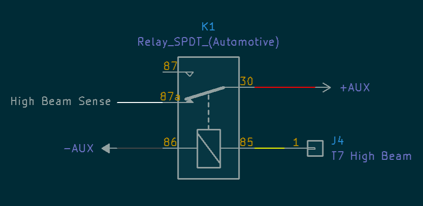

# The Tenere's high beam

TL;DR - Rather than going from 0V to 12V when you turn the high beams on, the wire from the high beam switch on the Tenere is at 12V and then drops when you turn the high beams on.

Generally the high beam switch on bikes is a simple on/off switch that turn on power to the high beam lights, so the voltage after the switch or at the high beam lights would go from 0V to 12V.

The Tenere doesn't work like this. The OEM light has a controller inside of it with dedicated 12V/ground lines, and the high beam switch controls a *logic signal*, not power. The logic is inverted from the traditional setups, so at low beam there is 12V coming out of the yellow wire that runs from the switch to the OEM headlight connector. When you turn the high beams on, this voltage drops to ~2-4V (but not 0V).

While some products like the Skene IQ-275X are designed to sense *low* high beam singals and work out-of-the-box, others don't. For example, the standard [Skene IQ-275](https://skenelights.com/skene-iq-275-intelligent-dimmer-for-led-lights.html)) have a high beam sense line to go to 100% power when you turn your high beams on. These expect an increase in voltage to 12V when you turn high beams on, which is the opposite of what the Tenere does. You can still use these with a standard automotive relay.

