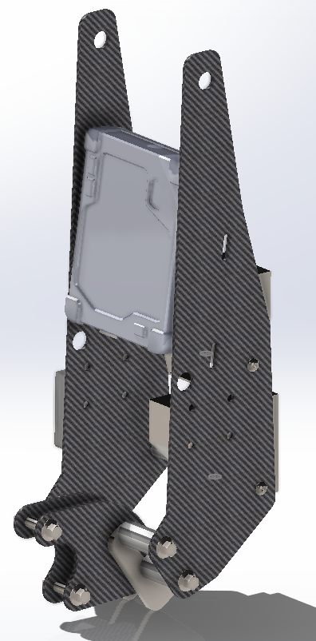

# Tenere 700 Rally Tower

This is a rally-style tower build for the Tenere 700.

## Overview

The tower is designed to provide an alternative to the Tenere's entire dash. The functional goals are to:
- Make space in the dash for additional components and aftermarket parts
- Increase illumination with brigher lights
- Reduce overall weight

...by replacing the following OEM components:
- Headlight (BW3-H4300-00-00)
- Headlight stay (BW3-F8321-00-00)
- Headlight support bracket (BW3-2831V-10-00)
- Display meter mount (BW3-F834L-00-00)

...with:
- Brackets
  - [bracket2](https://github.com/random1781/Tenere700/tree/main/tower/bracket2) - two of these form the support bracket
  - [bracket3](https://github.com/random1781/Tenere700/tree/main/tower/bracket3) - two of these form the tower itself
  - [bracket-meter](https://github.com/random1781/Tenere700/tree/main/tower/bracket-meter) - this is the bracket that the OEM display/dash bolts to
- Lights - choose your own! Mix and match! As long as the lights are >= 122mm and have side mounts, you can bolt them with spacers. For example...
  - [Baja Designs](https://www.bajadesigns.com/)
    - 2x Squadron Pro
    - 1x XL80 and 1x Squadron Pro
  - [Denali Electronics](https://denalielectronics.com/)
    - 2x D4
    - 1x D7 and 1x D4
  - [Clearwater](https://clearwaterlights.com/)
    - Anything up to the Sevina
  - [Amazon Special](https://www.amazon.com/Auxbeam-Strobe-Driving-Polaris-Wrangler/dp/B0BKRTSP36)
- Hardware - bolts, spacers, etc.

## Reference design

This design and bill of materials here is specifically for 1x Baja Designs XL80 on the top.

Spacing underneath allows for another smaller-sized light (Squadron / D4 or smaller) and *might* allow for another XL80 below it with minimal clearance. While the hole exists in this design, mounting hardware (spacers, longet bolts) are not included.

This reference design can be slightly modified by repositioning the holes to accommodate specific setups if necessary.

## Discussion
Join this discussion:
- https://www.tenere700.net/topic/6574-rally-tower-concept/
- https://www.advrider.com/f/threads/tenere-700-rally-style-tower.1645135/
