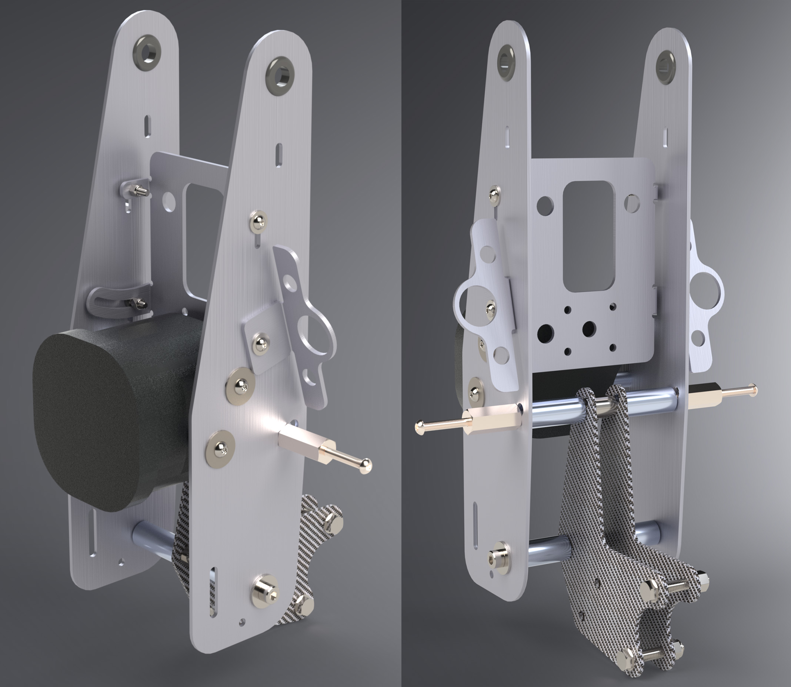
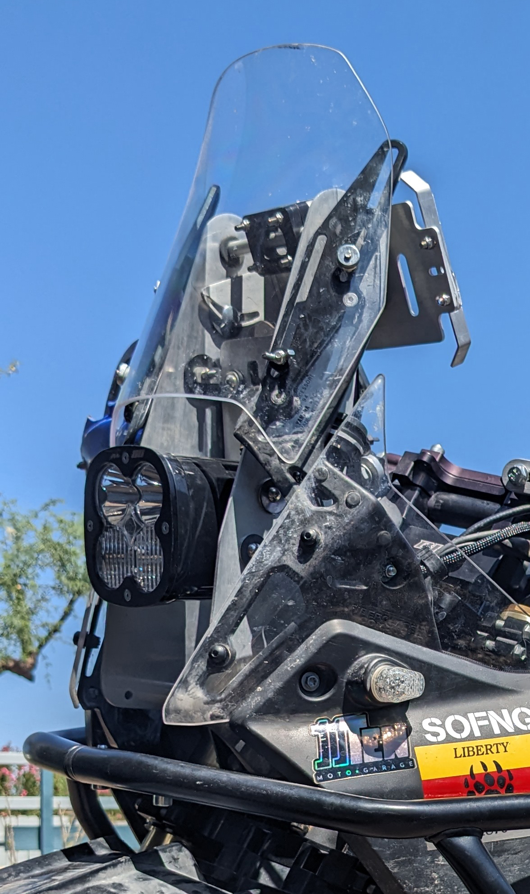
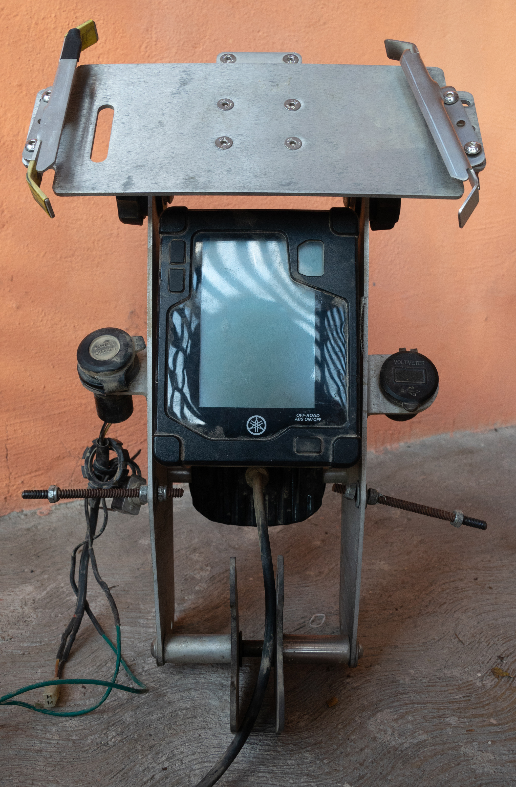

# Tenere 700 Rally Tower

This is a free, easy-to-build (or source), modular, and customizable rally-style tower *design* that provides an adjustable platform for larger navigation devices and aftermarket lights by replacing or eliminating OEM components in the front end, including the headlight. 

## Why?

The functional goals are to:
- Make space in the dash for additional components and aftermarket parts
- Provide a stable platform for large/heavy devices (i.e. tablets)
- Provide adjustability and customization
- Increase illumination with brighter light(s)
- Reduce overall weight
- Be easy to repair 

The unintentional benefits:
- Increased airflow (if you don't cover the front)
- Additional storage space - a spare tube fits perfectly in between the brackets
- Additional lateral strength

## How does it work?

It replaces the following OEM components:
- Headlight ([BW3-H4300-00-00](https://yamaha-motor.com/parts/diagram/10635215/242553596?partNumber=BW3H43000000))
- Headlight Stay ([BW3-F8321-00-00](https://yamaha-motor.com/parts/diagram/10635215/242410301?partNumber=BW3F83210000))
- Headlight Support Bracket ([BW3-2831V-10-00](https://yamaha-motor.com/parts/diagram/10635215/242410301?partNumber=BW32831V1000))
- Display Meter Mount ([BW3-F834L-00-00](https://yamaha-motor.com/parts/diagram/10635215/242368756?partNumber=BW3F834L0000))

...with:

##### Brackets

  - [Support Bracket](https://github.com/random1781/Tenere700/tree/main/tower/bracket-support) - two of these form the support bracket, replacing the [Headlight Stay](https://yamaha-motor.com/parts/diagram/10635215/242410301?partNumber=BW3F83210000)
  - [Tower Bracket](https://github.com/random1781/Tenere700/tree/main/tower/bracket-tower) - two of these form the tower itself
  - [Meter Bracket](https://github.com/random1781/Tenere700/tree/main/tower/bracket-meter) - this is the bracket that the [OEM Display Meter](https://yamaha-motor.com/parts/diagram/10635215/242368756?partNumber=BW3835002000) bolts to and replaces the [Display Meter Mount](https://yamaha-motor.com/parts/diagram/10635215/242368756?partNumber=BW3F834L0000)
  - [Aux Bracket](https://github.com/random1781/Tenere700/tree/main/tower/bracket-aux) - two of these attach to the sides, each offering a mount for 1x cigarette lighter-sized attachment and 2x switches
  
##### Lights

Choose your own! Mix and match! As long as the lights are <= ~5" / 127mm and have side mounts, you can bolt them on with spacers. Not all *vertical spacing* has been accounted for, but these example combos should work...
  - [Baja Designs](https://www.bajadesigns.com/)
    - 2x Squadron Pro
    - 1x XL80 and 1x Squadron Pro
	- 1x Squadron Pro and 2x S1
	- 1x LP4
  - [Denali Electronics](https://denalielectronics.com/)
    - 2x D4
    - 1x D7 and 1x D4
  - [Clearwater](https://clearwaterlights.com/)
    - Anything up to and including the Super Sevina
  - [Amazon Special](https://www.amazon.com/Auxbeam-Strobe-Driving-Polaris-Wrangler/dp/B0BKRTSP36)

##### Hardware

The rest is just hardware, the majority of which can be found at a local hardware store - one with one of those aisles of meticulously organized drawers of fasteners (think Ace or True Value and not Home Depot or Lowe's). All hardware in the reference design is based off inventory and designs from [McMaster-Carr](https://www.mcmaster.com/).

Whatever hardware you use, make sure it's stainless or some other corrosion-resistant material. We all know this, right?

## *Does* it work?

The original design had 18,001 miles before being revised. The only failure point was the threaded rods that bolt to the side panels: after ~5,000 miles they would fatigue and shear. This has been addressed in the latest version but has not been proven yet.

This is the original design immediately prior to upgrading it:

## Is this for me?

- Do you want any of the things listed above?
- Did you crack your headlight to discover that it's an expensive part sold only as an assembly and are having a difficult time finding a replacement part in stock somewhere? Did you then look at other rally towers available and think they were a bit expensive?
- Are you looking for a project or wanting to explore design and fabrication or manufacturing?

If yes, then you might be interested in this.

## How do I make the brackets?

1. Make them yourself.
2. If you can't, ask a friend for help.
3. If you don't have any of those, find a local fabricator.
4. If you can't find one or you don't want to leave your house, use a fabrication service, which is what I did since the above was true for me as well. In the US, [SendCutSend](https://www.sendcutsend.com) is an excellent, easy-to-use, and well-priced service that can create all these parts. The designs posted here are the ones that I sent in, and all the parts I had made were [fabricated by SendCutSend](images/production/v06/sendcutsend_package.jpg). They have additional options such as powder coating or anodization if you want to bling things up.

## Reference design

While this design is meant to be flexible and customizable, for the sake a common baseline, this design and bill of materials here is calls for for 1x Baja Designs XL80 on the top mounting point. 

The baseline for hardware and fasteners is [McMaster-Carr](https://www.mcmaster.com/) since everything except oversized neoprene washers can be obtained from there. This isn't necessarily recommended, however, since in many cases their minimum quantities per item are much higher than is required by this design. It's recommended that you first go to your local hardware store (such as Ace or True Value) that has the endless aisles of small drawers with fasteners and get everything you can from there and then order any remaining items online.

There is a substantial amount of flexibility regarding materials and fasteners used - hex heads, allen heads, Torx heads, etc. - but as long as lengths are correct, you'll be fine.

## Documents

- [Version history](https://github.com/random1781/Tenere700/tree/main/tower/Documents/CHANGELOG.MD)
- [Electronics build](https://github.com/random1781/Tenere700/tree/main/tower/electronics)

## To do

Add documentation:

- Detailed installation instructions with diagrams
- SendCutSend-specific instructions
- Wiring an aftermarket light to the Tenere's high beam switch
- Add additional light mockups
- Detail electronics build

## Discussion, feedback, and questions

Join the discussions here:
- https://www.tenere700.net/topic/6574-rally-tower-concept/
- https://www.advrider.com/f/threads/tenere-700-rally-style-tower.1645135/

If you have any feedback, suggestions, or questions, feel free to contact me here, on social media, or at scott@advgoats.com.

If you do wind up using this design, share some pictures!

## Support

If you find this useful, consider helping keeping the ~~beer fridge~~ [Nalgene flasks](https://nalgene.com/product/10oz-flask/) stocked...

See what living on a couple motorcycles with a dog is like:

 

