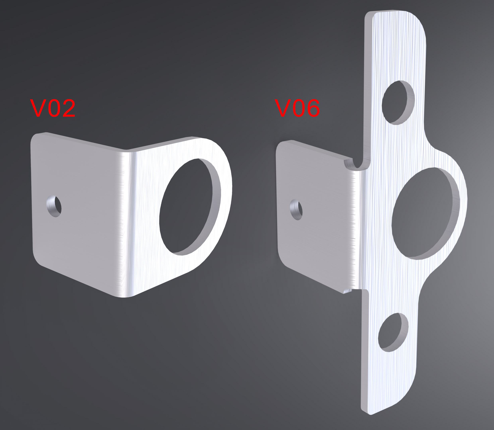

# Aux Bracket

## Overview

One Aux Bracket can be added per side to the outside face of the [Tower Brackets](https://github.com/random1781/Tenere700/tree/main/tower/bracket-tower) to support the [OEM cigarette lighter port](https://yamaha-motor.com/parts/diagram/10635215/242380396?partNumber=B568254B0100) and an additional device such as a USB charger on the opposite side where the [OEM blank space](https://yamaha-motor.com/parts/diagram/10635215/242380396?partNumber=2BS247470000) is.

Both versions of this bracket support one cigarette lighter-style adapter while V06 adds two 8mm cutouts for 12.5mm (0.5") cutouts for switches.

## Fabrication Notes

**Recommended material:** Aluminum (any alloy)
**Recommended gauge:** 3mm
**Reference dimensions:** 28.5mm diameter of cigarette lighter cutout

## Installation Notes

This is simply bolted on to the side of the [Tower Brackets](https://github.com/random1781/Tenere700/tree/main/tower/bracket-tower) using the lower [Meter Bracket](https://github.com/random1781/Tenere700/tree/main/tower/bracket-meter) bolts.

The wires for the [OEM cigarette lighter port](https://yamaha-motor.com/parts/diagram/10635215/242380396?partNumber=B568254B0100) will need to be extended in order for them to reach the connector.

Bend lines are indicated by dashed lines and are dimensioned in accordiance with SendCutSend's [guidelines](https://sendcutsend.com/materials/5052-aluminum/) for 0.125" 5025 aluminum.

## Other Notes

If ordering these from on online service such as [SendCutSend](https://sendcutsend.com/), it's cheaper to get two of the same design rather than one of each.

---

Sourcing quality switches is important. These [NKK On/Off switches](https://www.mouser.com/ProductDetail/633-S1AWF) and [splashproof boot](https://www.mouser.com/ProductDetail/633-AT4181) are a good choice.

---

Likewise, sourcing quality USB chargers is important and difficult. Many cheap chargers make claims that are untrue and you'll find that your device consumes more power than the charger can actually output. Consider these companies:

- [Anker](https://www.anker.com)
- [Coolgear](https://www.coolgear.com/)

## Necessary hardware

|Component|Part Number|Quantity|
|--|--|--|
|bracket-aux-v02 or bracket-aux-v06|-|2|

## Support

If you find this useful, consider helping keeping the beer fridge stocked...

