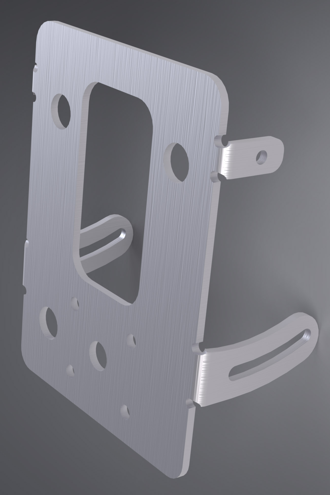

# Meter Bracket

This bracket replaces Yamaha part [BW3-F834L-00-00](https://yamaha-motor.com/parts/diagram/10635215/242368756?partNumber=BW3F834L0000) and reuses Yamaha parts [5PS-83513-00-00](https://yamaha-motor.com/parts/diagram/10635215/242368756?partNumber=5PS835130000) and [90164-05001-00](https://yamaha-motor.com/parts/diagram/10635215/242368756?partNumber=901640500100).

## Overview

This bracket provides a mounting point for the [OEM Display Meter](https://yamaha-motor.com/parts/diagram/10635215/242368756?partNumber=BW3835002000). The slotted lower tabs on either side allow the bracket and display to pivot about the upper tabs.

The four small holes are arranged in an [AMPS pattern](https://support.garmin.com/en-US/?faq=gwpdFQdJfH4oFEZ6hC4gG6) and are intended for future use along with the larger hole in the center of the AMPS pattern.

## Fabrication Notes

**Recommended material:** 5052 aluminum
**Recommended gauge:** 3mm
**Reference dimensions:** front face width: 112mm / front face height: 150mm

This part does not experience much stress and can be made with most aluminum alloy that allow for bending.

The gauge accounts for the overall width after bending the tabs. This also allows the [OEM Dampers](https://yamaha-motor.com/parts/diagram/10635215/242368756?partNumber=5PS835130000) (grommets) to be reused.

The tabs should be bent to 90 degrees. Take care to ensure the bend direction is correct: when facing the bracket straight on with the two vertical holes for the [OEM Dampers](https://yamaha-motor.com/parts/diagram/10635215/242368756?partNumber=5PS835130000) on the *left* side, the tabs should be bent downwards. However, if you do bend the tabs in the wrong direction, you can still save the part by drilling an additional hole for the bottom [OEM Dampers](https://yamaha-motor.com/parts/diagram/10635215/242368756?partNumber=5PS835130000).

The holes for the AMPS pattern are not necessary and can be omitted along with the hole in the center of the AMPS pattern.

## Installation Notes

Remove the (3) [OEM Dampers](https://yamaha-motor.com/parts/diagram/10635215/242368756?partNumber=5PS835130000) that are attached to the [OEM bracket](https://yamaha-motor.com/parts/diagram/10635215/242368756?partNumber=BW3F834L0000) and retain the [OEM Screws](https://yamaha-motor.com/parts/diagram/10635215/242368756?partNumber=901640500100). Install the OEM Dampers on the aluminum bracket and use the OEM Screws to mount the Display Meter to the bracket.

---

In the OEM configuration, the ambient [air temperature sensor](https://yamaha-motor.com/parts/diagram/10635215/242380396?partNumber=5YU858860000) is [bolted](https://yamaha-motor.com/parts/diagram/10635215/242368756?partNumber=913170501400) onto the [OEM bracket](https://yamaha-motor.com/parts/diagram/10635215/242368756?partNumber=BW3F834L0000). The wire for the sensor splits off from the bundle of wires that connect to the [Display Meter](https://yamaha-motor.com/parts/diagram/10635215/242368756?partNumber=BW3835002000).

Zip-tie or tape the sensor inline with this bundle taking care to position it so that it is not exposed to direct sunlight. This helps keep the expected temperature range similar to what it would be in the OEM configuration. The whole bundle can be routed in between the [Support Brackets](https://github.com/random1781/Tenere700/tree/main/tower/bracket-support) to keep it shielded/protected.

---

The M5 neoprene washers should go in between the tabs and the [Support Brackets](https://github.com/random1781/Tenere700/tree/main/tower/bracket-support). The M5 oversized washers (2) should go in between the M5 locknuts and the bottom tabs and (2) in between the M5x22 screw head and the [Aux Brackets]().

## Other Notes

- The M5 oversized neoprene washers are not available from McMaster. These are meant to damper the whole bracket/display assembly as well as fill the gap between the tabs and the [Support Brackets](). The dimensions don't need to be exact and the only really significant dimension is the thickness. This should account for the distance between the tabs and the [Support Brackets](), which will vary, but is approximately 3-5mm.
- The length of the M5x22 screws accommodates the [Aux Brackets](https://github.com/random1781/Tenere700/tree/main/tower/bracket-aux) with a 3mm gauge.
- The cable from the [OEM Display Meter](https://yamaha-motor.com/parts/diagram/10635215/242368756?partNumber=BW3835002000) sticks out the back about 25mm.

## Necessary hardware

|Component|Part Number|Quantity|
|--|--|--|
|bracket-meter|-|1|
|M5x22mm button head screw|[90202A105](https://www.mcmaster.com/92095A482)|4|
|M5 locknut|[93625A112](https://www.mcmaster.com/93625A112/)|4|
|M5 oversized washer|[93849A103](https://www.mcmaster.com/93849A103)|4|
|M5 oversized neoprene washer, 3-5mm thick|[93625A112](https://www.mcmaster.com/93625A112/)|4|
|Damper|[5PS-83513-00-00](https://yamaha-motor.com/parts/diagram/10635215/242368756?partNumber=5PS835130000)|3|
|Screw|[90164-05001-00](https://yamaha-motor.com/parts/diagram/10635215/242368756?partNumber=901640500100)|3|

## Support

If you find this useful, consider helping keeping the beer fridge stocked...

