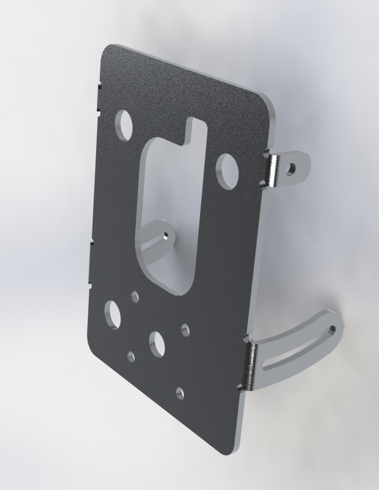

# bracket-meter

This bracket replaces Yamaha part BW3-F834L-00-00.

## Considerations
- This should be made approximately 3mm thick to accommodate the OEM grommets.
- The cable from the display meter sticks out the back about 25mm. Because of this, spacers might be required depending on where this is mounted.
- The ambient air temperature sensor is bolted onto the OEM mount. The cable for the sensor is wrapped along with the cable for the display itself. The sensor is shielded from direct sun and wind, so take care to tuck it out of the way to avoid erroneous inputs.

## Necessary hardware
|Component|Part Number|Quantity|
|--|--|--|
|bracket-meter|-|1|
|M5 20mm Coupling nut|[90202A105](https://www.mcmaster.com/catalog/129/3609/90202A105)|4|
|M5 locknut|[93625A112](https://www.mcmaster.com/93625A112/)|4|
