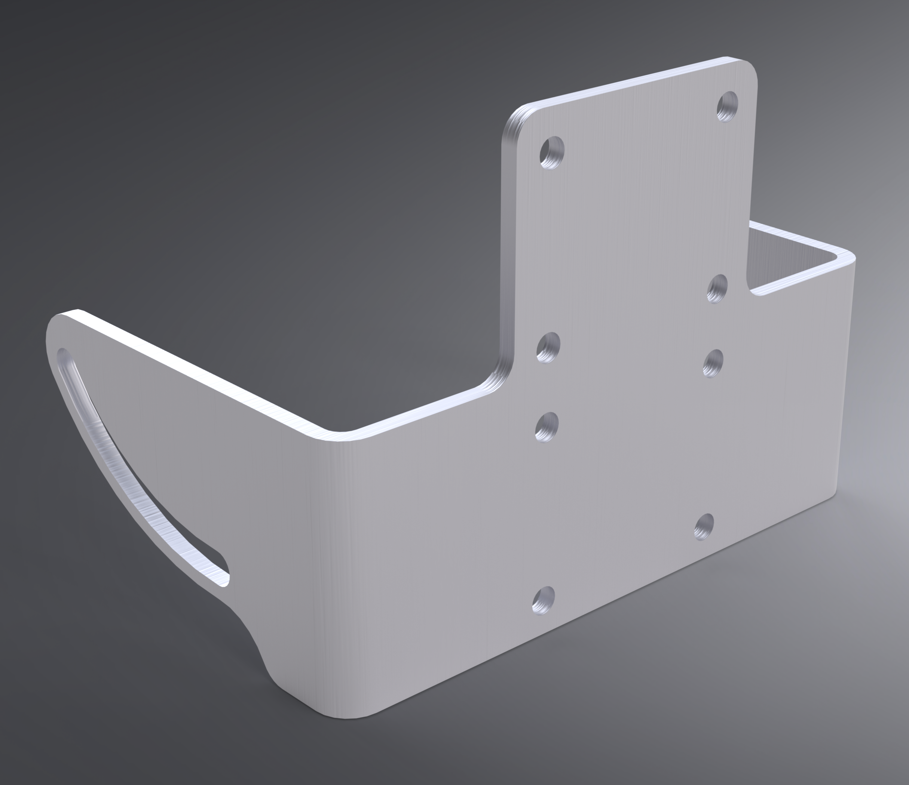
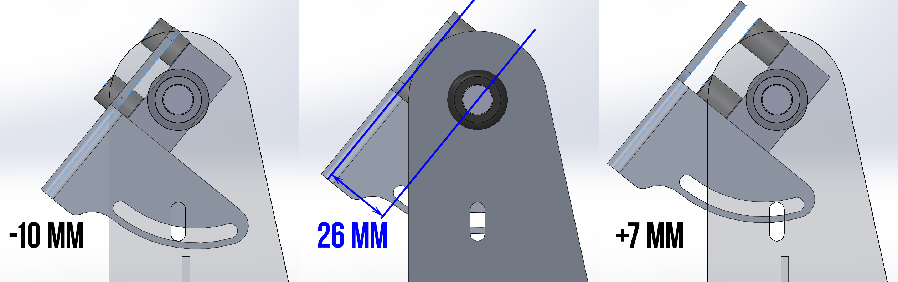

# Nav Adjuster Bracket

## Overview

This bracket bolts on to a standard [GPS bar clamp](https://adv-tim.com/products/amps-base-12mm) with AMPS pattern and to the [Tower Brackets](../bracket-tower) using M5 threaded knobs to provide rotational adjustment of a navigation device in addition to extra support for the assembly as a whole. A navigation device with an AMPS pattern can be mounted in one of two positions (high or low).

## Fabrication Notes

**Recommended material:** 5052 aluminum

**Recommended gauge:** 3mm / 0.125"

**Reference dimensions:** 86mm from top edge to bottom edge; AMPS pattern is 38mm width and 30mm height

Depending on the application, the holes for the top AMPS pattern might need to be countersunk. For example, if utilizing the bottom AMPS pattern and the navigation device/mount extends upwards, a standard bolt might block it.

This bracket can be produced by [SendCutSend](https://sendcutsend.com), however due to limitations in their tooling, bending can cause [deformation in the slots](images/deformation.jpg). After being informed of this possibility, I chose to proceed and simply sized up on the carriage bolts, however you can elect to have one side bent and then bend the other yourself.

Bend lines are indicated by dashed lines and are dimensioned in accordiance with SendCutSend's [guidelines](https://sendcutsend.com/materials/5052-aluminum/) for 0.125" 5025 aluminum.

## Installation Notes

The [GPS bar clamp](https://adv-tim.com/products/amps-base-12mm) should not be tightened as much as it would be for standalone use in order to allow rotational adjustment using the knobs only. Tighten the [GPS bar clamp](https://adv-tim.com/products/amps-base-12mm) enough to be movable with some tension when rotating it from the bottom of the Nav Adjuster Bracket. Ensure that you use locknuts for the bolts holding the [GPS bar clamp](https://adv-tim.com/products/amps-base-12mm) on.

The oversized neoprene washers go in between the [Tower Brackets](../bracket-tower) and the Nav Adjuster Bracket with the carriage bolts.

## Other Notes

The distance from the center of the [GPS support bar]() to the rear face of the Nav Adjuster Bracket affects the point on the Tower Bracket where the slot of the Nav Adjuster Bracket will intersect. Because [GPS bar clamps](https://adv-tim.com/products/amps-base-12mm) vary in height, the mount point on the Tower Bracket is slotted in order to accommodate various mounts.

The GPS bar clamp in this reference design has a total height of 22mm, meaning the front and back surfaces are 11mm from the center of the [GPS support bar](). [16mm spacers](https://www.mcmaster.com/94669A183/) are used in order to bring the total distance from the center of the [GPS support bar]() to the rear face of the Nav Adjuster Bracket to 26mm.

The absolute limits are 16mm-33mm. Distances <25mm will place the front face of the Nav Adjuster Bracket below the [Tower Brackets](../bracket-tower). Nav devices wider than the width of the [Tower Brackets](../bracket-tower) (~125mm) will impact.

## Necessary hardware

|Component|Part Number|Quantity|
|--|--|--|
|bracket-nav_adjuster|-|2|
|M5x16mm carriage bolts|[97248A413](https://www.mcmaster.com/97248A413/)|2|
|M5 neoprene oversized washers| - |2|
|M5 female threaded knobs|[62265K512](https://www.mcmaster.com/62265K512/)|2|
|M5x35mm countersunk bolts|[92125A222](https://www.mcmaster.com/92125A222/)|4[^1]|
|M5 locknut|[93625A114](https://www.mcmaster.com/93625A114)|4[^1]|

[^1]: this hardware is dependent on the particular GPS bar clamp used

## Support

If you find this useful, consider helping keeping the ~~beer fridge~~ [Nalgene flasks](https://nalgene.com/product/10oz-flask/) stocked...

