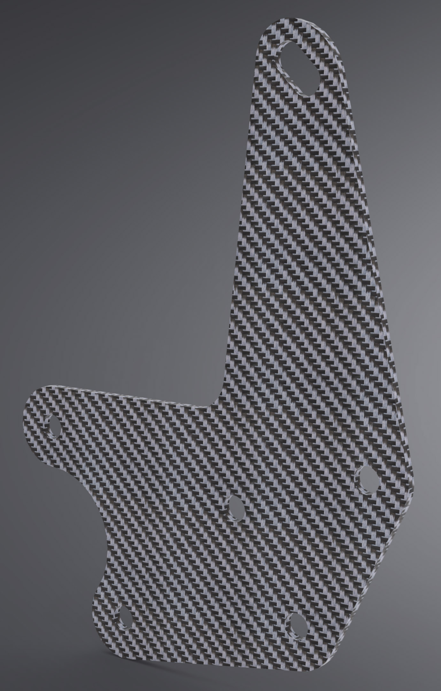

# Support Bracket

Two of these brackets replace Yamaha part [BW3-2831V-10-00](https://yamaha-motor.com/parts/diagram/10635215/242410301?partNumber=BW32831V1000).

## Overview

This assembly attaches to the steering head (two left-most holes) and provides virtually all support for the whole tower (right-most hole and top slot). This design retrains the two holes (centered) that the OEM headlight attach to since many crash bars use this as a mounting point.

The assembly is essentially two sheets of material with spacers in between, similar to the [OEM bracket](https://yamaha-motor.com/parts/diagram/10635215/242410301?partNumber=BW32831V1000) that has spacers welded in between two small-gauge steel sheets. The mounting points on the frame serves as spacers 

The OEM bolts that attach the bracket to the steering head are reused.

## Fabrication Notes

**Recommended material:** Carbon fiber or G10 fiberglass; 7075 T6 aluminum 
**Recommended gauge:** 3mm
**Reference dimensions:** 64mm between center of frame bolts

A composite is highly recommended primarily because this assembly occasionally sees lateral impacts from hard crashes where the side panels are impacted. With the bike at stock this is rare, but using crash bars that bolt onto this assembly greatly increases the likelihood of lateral stress. A metal will bend, such as with the OEM bracket, but a composite may flex and then return to its original position.

Since using composites increases the complexity of fabrication, 7075 T6 aluminum of the same gauge can be used as an alternative. This alloy has a much higher yield strength than other alloys or common steals and will be more resistant to bending.

## Installation Notes

This assembly should first be loosely bolted to the frame. Once in place, the [Tower Brackets](https://github.com/random1781/Tenere700/tree/main/tower/bracket-tower) can be loosely mounted along with the [Meter Bracket](https://github.com/random1781/Tenere700/tree/main/tower/bracket-meter) and [Aux Bracket](https://github.com/random1781/Tenere700/tree/main/tower/bracket-aux).

Once everything is in place, tighten the two frame bolts to a torque of "really tight" and then continue tightening the hardware for [Tower Brackets](https://github.com/random1781/Tenere700/tree/main/tower/bracket-tower).

## Other Notes

The outer width of the [OEM bracket](https://yamaha-motor.com/parts/diagram/10635215/242410301?partNumber=BW32831V1000) (from outer face to outer face) is 27mm. This design references a material gauge of 3mm for each bracket, leaving 21mm of inner space that needs to be filled. This design calls for 20mm spacers and a 20mm coupler, each paired with (2) M8 washers to fill this void, however depending on the specific hardware used, the two washers may not be necessary.

Try to bring the gap as close to 21mm as possible, but there is a 1-2mm tolerance either way and does not need to be exact. However, ensure that you are consistent with what you do across all the spacers.

---

The [OEM bolts](https://yamaha-motor.com/parts/diagram/10635215/242410301?partNumber=BW3283360000) and [OEM nuts](https://yamaha-motor.com/parts/diagram/10635215/242410301?partNumber=901760800900) that attach the assembly to the frame can be reused, however they are fairly short. Since these support virtually all the weight of the whole tower assembly, it is recommended that you source quality bolts long enough to have enough thread outside the nut, which should be a locking nut of sorts.

---

The top-most mounting point is slotted. This allows for adjustability to account for variances in the overall assembly since this serves not only as a mounting point for the tower assembly itself, but also for the side panels ([BW3-F836K-00-00](https://yamaha-motor.com/parts/diagram/10635215/242410301?partNumber=BW3F836K0000) and [BW3-F836L-00-00](https://yamaha-motor.com/parts/diagram/10635215/242410301?partNumber=BW3F836L0000)).

## Necessary hardware

|Component|Part Number|Quantity|
|--|--|--|
|bracket-support|-|2|
|M8 20mm spacer|[92871A847](https://www.mcmaster.com/catalog/129/3668/92871A847)|3\* or 1|
|M8 oversized washer|[98363A113](https://www.mcmaster.com/98363A113/)|10[^1] or 6|
|M8x45 hex head bolt|[91287A307](https://www.mcmaster.com/91287A307/)|2[^2]|
|M8 locknut|[93625A114](https://www.mcmaster.com/93625A114)|2\*\*|
|M8 washer|[93475A270](https://www.mcmaster.com/93475A270/)|2\*\*|

[^1]: if using a crash bar that mounts to the this bracket*
[^2]: if not reusing [OEM bolts](https://yamaha-motor.com/parts/diagram/10635215/242410301?partNumber=BW3283360000)*

## Support

If you find this useful, consider helping keeping the beer fridge stocked...

