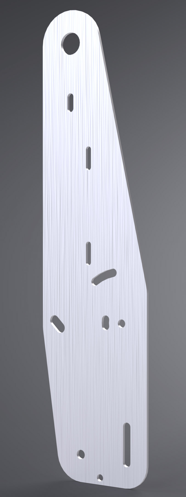
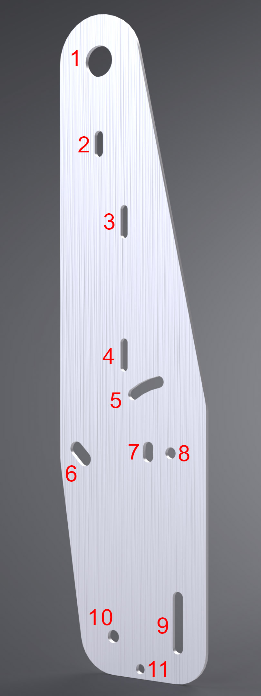

# Tower Bracket

Two of these form the tower assembly and serve as the base for all components other than the Support Brackets.

## Overview

This bracket provides the mounting points for:

- [Meter Bracket](https://github.com/random1781/Tenere700/tree/main/tower/bracket-meter)
- [Aux Bracket](https://github.com/random1781/Tenere700/tree/main/tower/bracket-aux)
- Light(s)
- OEM side panels ([BW3-F836K-00-00](https://yamaha-motor.com/parts/diagram/10635215/242410301?partNumber=BW3F836K0000) and [BW3-F836L-00-00](https://yamaha-motor.com/parts/diagram/10635215/242410301?partNumber=BW3F836L0000))
- [OEM GPS bar](https://yamaha-motor.com/parts/diagram/10635215/242410301?partNumber=BW3F831T0000)

## Fabrication Notes

**Recommended material:** 6061 or 7075 T6 aluminum 

**Recommended gauge:** 3mm

**Reference dimensions:** 400mm height from flat base to upper-most point of the top curve

These primarily provide attachment points for other components and clamp everything together. The spacers and light provide lateral strength and together with the OEM side panels create a very strong assembly. They could be made out of composites, but at a significant cost with a negligible strength/weight benefit.

My first version was made from 7075. After 18,000 miles and time near the ocean, there was some [slight discoloration/darkening](../images/production/misc/bracket-tower_comparison.jpg) of the material. I opted for 6061 for the second version of these to see if its higher corrosion-resistance would prevent this, however they haven't been on long enough to make an assessment.

## Installation Notes

The Support Brackets should first be loosely installed.

1. Slide threaded rod through the slot of one Tower Bracket along with these components in order:
  - Tower Bracket
    - Spacer
      - Support Bracket
    	- M8 washer
	      - Spacer
	    - M8 washer
      - Support Bracket
    - Spacer
  - Tower Bracket
1. Loosely thread the M8x65 socket cap bolts along with washers to the coupler.
1. Loosely thread the M6/M8 adapters to the threaded rod.
1. Place the M6x40 bolts through the side panels.
1. From the inside of the panels, slide the neoprene washers onto the M6x40 bolts followed by the oversized M6 washers and M6 nut (but do not tighten).
1. Loosely thread the M6x40 bolts to the M6/M8 adapters.
  
You are now in able to align the entire threaded rod to a natural position in the slot based off the position of the side panels. Once this is in place, snug the M6/M8 thread adapters so the threaded rod stays in place, but do not torque it down.

Install the remaining brackets and headlight.

Once all of this is complete, you will need to adjust the spacing of both side panels by tightening/loosening the M6x40 bolts. When viewed from the front, the gap between both side panels at the narrowest point should be 125mm, or about the width of the Tower Support brackets.

Once this is complete, tighten the nuts on the M6x40 bolts. They should be just tight enough to secure the side panels and prevent the bolt and neoprene washer from rotating, but not torqued down.
 
## Other Notes

1. [OEM GPS bar](https://yamaha-motor.com/parts/diagram/10635215/242410301?partNumber=BW3F831T0000)
2. Slot for tablet mount
3. [Meter Bracket](https://github.com/random1781/Tenere700/tree/main/tower/bracket-meter)
4. [Meter Bracket](https://github.com/random1781/Tenere700/tree/main/tower/bracket-meter)
5. XL80 rotational adjustment
6. [Support Bracket](https://github.com/random1781/Tenere700/tree/main/tower/bracket-support) attachment point (threaded rod)
7. LP4 rotational adjustment
8. Primary light
9. Secondary light with vertical adjustment
10. [Support Bracket](https://github.com/random1781/Tenere700/tree/main/tower/bracket-support) attachment point (M8x65 bolts and coupler)
11. Seconday attachment point for side panels - alignment not yet verified

---

The length of the spacers has some tolerance. +/- 1-3mm is acceptable without needing different hardware, and +/- 5-6mm is the maximum allowable. Any *more* than this and the Tower Brackets will reach the extent of the [OEM GPS bar](https://yamaha-motor.com/parts/diagram/10635215/242410301?partNumber=BW3F831T0000) and will impact the side panels where it attaches to. Any *less* and the [Meter Bracket](https://github.com/random1781/Tenere700/tree/main/tower/bracket-meter) won't fit.

---

The M6 neoprene washers should be as thick and compressible as possible. The angle of the OEM side panels where the M6 bolts clamps onto is not perfectly parallel to the Support Brackets, so the purpose of these washers is to provide damping for the tension needed to secure the panels.

## Necessary hardware
|Component|Part Number|Quantity|
|--|--|--|
|bracket-tower|-|2|
|M8x65 socket head bolt|[91292A210](https://www.mcmaster.com/91292A210/)|2|
|M8 20mm coupling nut|[90202A105](https://www.mcmaster.com/catalog/129/3609/90202A105)|1|
|Spacer, 1 7/8"|[92510A592](https://www.mcmaster.com/92510A592)|4|
|M6/M8 threaded adapter|[92909A139](https://www.mcmaster.com/92909A139)|2|
|M8 threaded rod, 150mm|[93805A641](https://www.mcmaster.com/93805A641)|1|
|M8 washer|[93475A270](https://www.mcmaster.com/93475A270/)|4|
|M8 oversized washer|[98363A113](https://www.mcmaster.com/98363A113/)|2|
|M6x40 button head bolt|[94500A317](https://www.mcmaster.com/94500A317/)|2|
|M6 oversized washer|[96505A114](https://www.mcmaster.com/96505A114)|2|
|M6 oversized neoprene washer||2|
|M6 nut|[93625A113](https://www.mcmaster.com/93625A113)|2|
|Grommet, 12mm ID, 3mm ID width|[9600K318](https://www.mcmaster.com/9600K318)|2|

## Version History

- 8b - reduced the radius of the top arc that goes around the GPS bar. In one instance this was impact the windscreen.

## Support

If you find this useful, consider helping keeping the beer fridge stocked...

