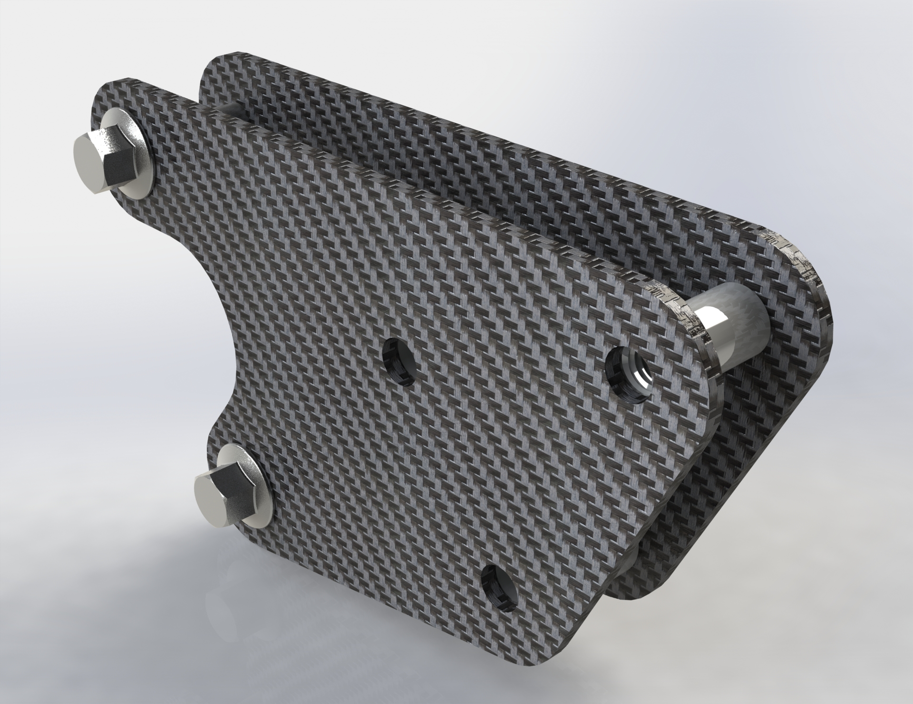

# bracket2

This bracket replaces Yamaha part BW3-2831V-10-00.

## Overview
This bracket attaches to the steering head (two left-most bolts) and provides support for the tower (right-most hole). This design retrains the two holes (centered) that the OEM headlight attach to. These are retained because many crash bars use this as a mounting point.

The OEM bolts that attach the bracket to the steering head are reused.

## Distances
Spacing between the outer faces of both brackets is 27mm. The inner spacing is 21mm.

## Necessary hardware
|Component|Part Number|Quantity|
|--|--|--|
|bracket2|-|2|
|M8 20mm coupling nut|[90202A105](https://www.mcmaster.com/catalog/129/3609/90202A105)|1|
|M8 20mm spacer|[92871A847](https://www.mcmaster.com/catalog/129/3668/92871A847)|1|
