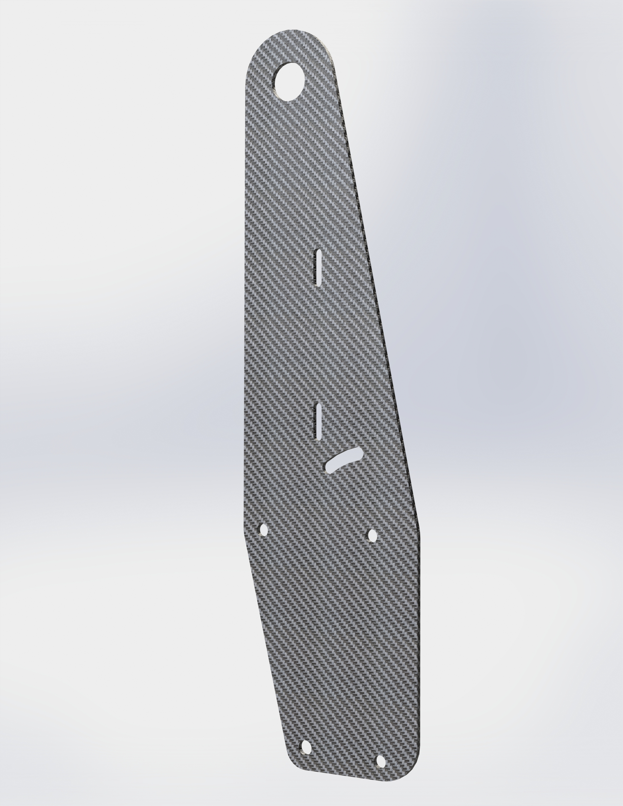

# bracket3

## Necessary hardware
|Component|Part Number|Quantity|
|--|--|--|
|bracket3|[bracket3-v06](bracket3-v06.svg)|2|
|Bolt, button head, M8x60|[92095A300](https://www.mcmaster.com/92095A300)|2|
|Spacer, 1 7/8" L, 0.315" ID|[90202A105](https://www.mcmaster.com/90202A105)|2|
|Grommet, 0.5" ID, 0.75" hole diameter|[9600K318](https://www.mcmaster.com/9600K318)|2|

## XL80 hardware

These are the components necessary to mount a Baja Designs XL80.

|Component|Part Number|Quantity|
|--|--|--|
|Bolt, 1/4-20, 1.25" L|[92949A544](https://www.mcmaster.com/92949A544)|4|
|Spacer, 11/16" L, 0.252" ID|[92511A045](https://www.mcmaster.com/92511A045)|4|
