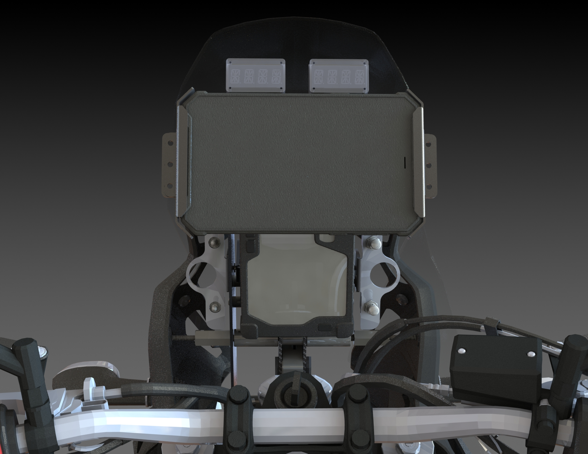

# Electronics build

This will detail the electronics package I'm building out to accompany the tower.

## Overview

The Tenere's OEM dash is meant to mimic a rally-style setup, but the UI is lacking, both in terms of display and operation with the single select button. Important (to me) information is buried, hard to access or reset, or simply not available at all.

The overall intent of this is to gather relevant information, display it in a more readable fashion, and interact with it.

## Design

The components consist of:

- Arduino with CAN interface
- GPS with a high refresh rate
- IMU
- Seven segment displays
- LCD for development
- USB hub

Everything is connected via an I2C bus to the Arduino. The GPS is also connected to the USB hub both to power everything and to pass data to the tablet more accurate location data to the tablet.

Work on this is rather slow, but the initial configuration is looking like this:

## Is this necessary?

About as necessary as any other mod people do to their bikes.

## Background

When I initially began spitballing a tower, I wanted to completely exclude the OEM dash. While this is 98% feasible, the odometer and trip meter are calculated and stored in the OEM dash. Because of this, while virtually everything about the bike is easily available from the CAN bus with a cheap dongle, these values aren't because they never leave the OEM dash. The trip meter in particular is really important to me because I'm normally a frequent user of it while riding offroad, but the Tenere's UI makes them unusable for this purpose.

This is something that I've wanted to have accessible, along with a more accurate GPS. I know there are app-based solutions for this, but they don't work exactly how I would like and they don't work with my navigation setup; I'm looking for dedicated displays. The intent is to have an initial setup similar to this:

