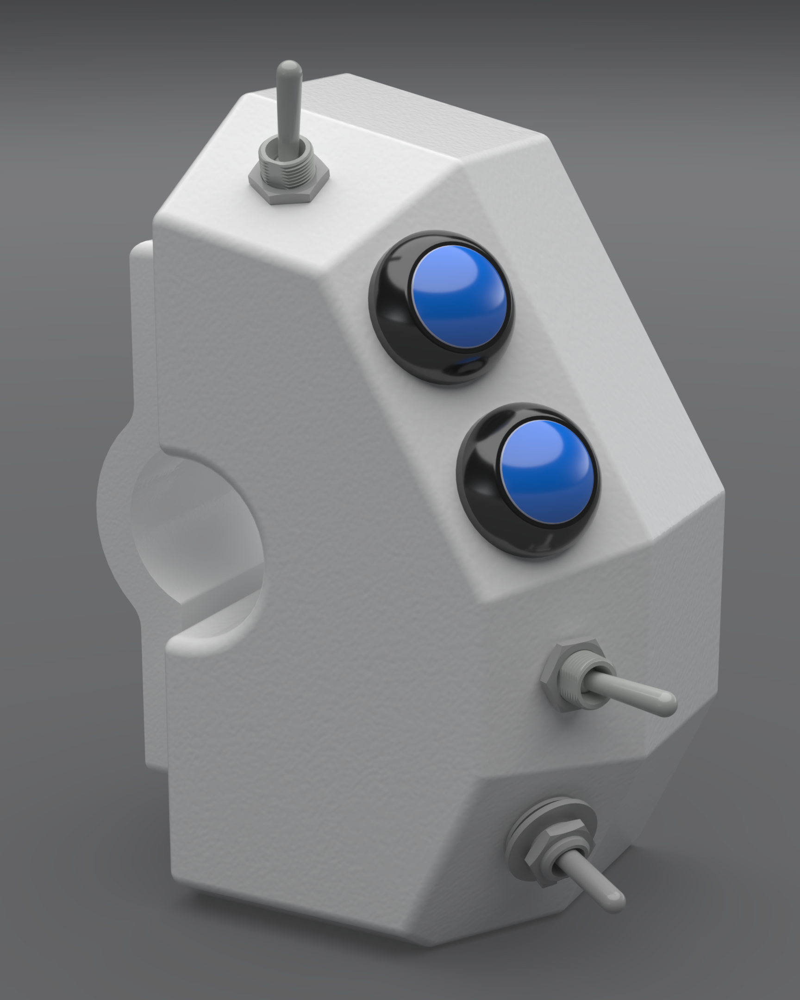
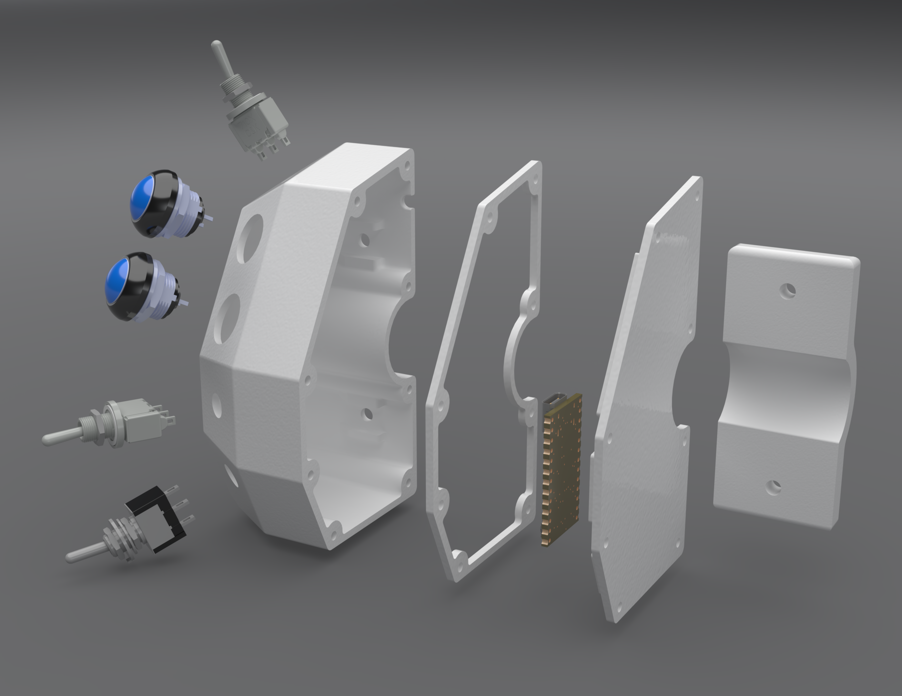

# Bar Controller

## Components

- [Bar controller base](bar_controller_base)
- [Bar controller lid](bar_controller_lid) - Includes space posts for:
  - [KB2040](https://www.adafruit.com/product/5302)
- [Bar controller gasket](bar_controller_gasket)
- [Bar controller clamp](bar_controller_clamp)

## Mounting

This is meant to mount flush with the left handgrip. I have relocated all the OEM left-side switches to the right, so there is ample space for this. This is extremely wide, so handlebar space might be an issue. This initial version is as wide as it is simply because I had the room to make it that way, and the extra space meant not having to cram components and wires in a tight area. Since I lack decent tools, this was helpful for me.

## Cable cutouts

There is one cutout on outside (facing the front of the bike) to allow a USB cable through.