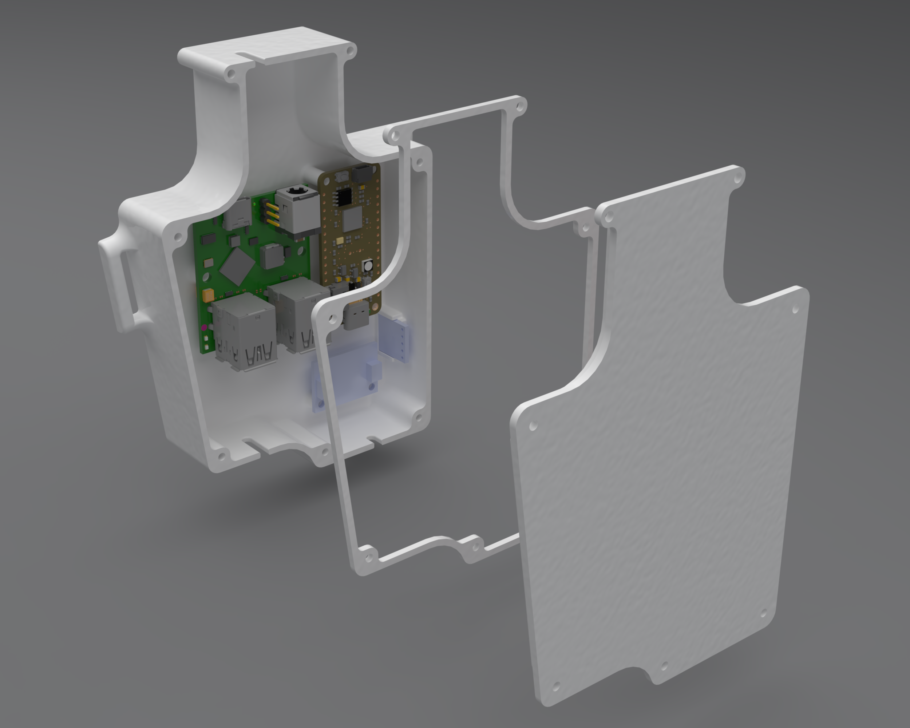
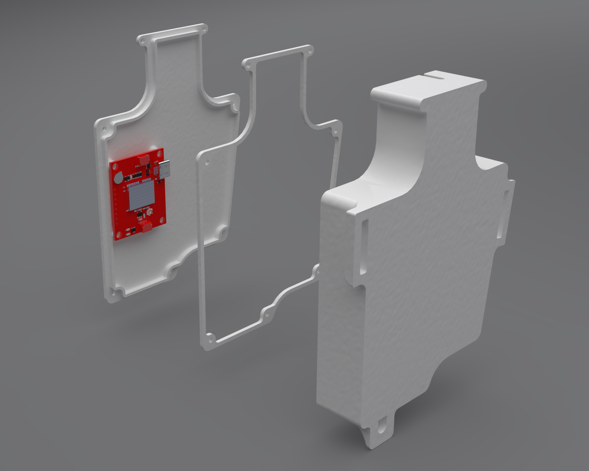

# Electronics Enclosure

## Components

- [Enclosure base](enclosure_electronics_base)
  Includes mounting posts for: 
  - [RP2040 CAN Feather](https://www.adafruit.com/product/5724)
  - [CoolGear CG-3590X4AX1C-PD-PCBA USB hub](https://www.coolgear.com/product/4-port-usb-3-2-gen-1-micro-powered-hub-pcba-w-gl3590-chipset-esd-surge-protection)
  - [IMU](https://www.adafruit.com/product/4502)
- [Enclosure lid](enclosure_electronics_lid)
  Includes mounting posts for:
  - [NEO-M9N GPS](https://www.sparkfun.com/products/17285)
- [Enclosure gasket](enclosure_electronics_gasket)

## Mounting

There is one post to bolt onto the tower itself along with guides for a [Voile strap](https://www.voile.com/voile-straps.html) or similar. In practice, just one strap works fine to mount.

## Cable cutouts

There is one cutout on top and two on the bottom for cables to pass through. The one on the top is a bit short and required some filing to allow all the cables to pass through. I used a copious amount of silicone to seal all the cutouts after the cables were run.